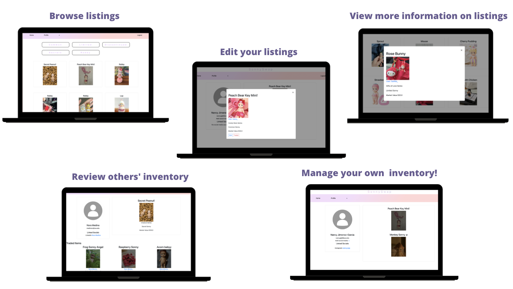

{: width="250" }
# Project
Welcome to SonnySwap!

We've created a web application that allows individuals the opportunity to trade Sonny Angels with other enthusiasts. We aim to provide a space for a diverse range of individuals, including Sonny Angel enthusiasts, where they can have a way to  connect, trade, and share their inventories with ease.

Check out our blog posts (listed below) to see the amazing work we've completed throughout the quarter!

## Key Features

## Meet the Team!
### Nancy Jimenez-Garcia (she/her)
{: width="250" }
### Nora Medina (she/her)

### Andy Thai (he/him)

### Gai Wai Wong (she/her)
{: width="250" }

## Blog Posts
### [G1: User Research Report](./posts/G1.md)
### [G2: Pitch Presentation](./posts/G2.md)
### [G3A: Components](./posts/G3AC.md)
### [G3BC: Report for Low Fidelity Prototype](./posts/G3C.md)
### [G4: Code and Design Specification](./posts/G4.md)
### [G5: Midterm Presentation](./posts/G5.md)
### [G6: User Testing](./posts/G6.md)
### [G7: Digital Prototype](./posts/G7.md)
### [G8: Video Demo](./posts/G8.md)