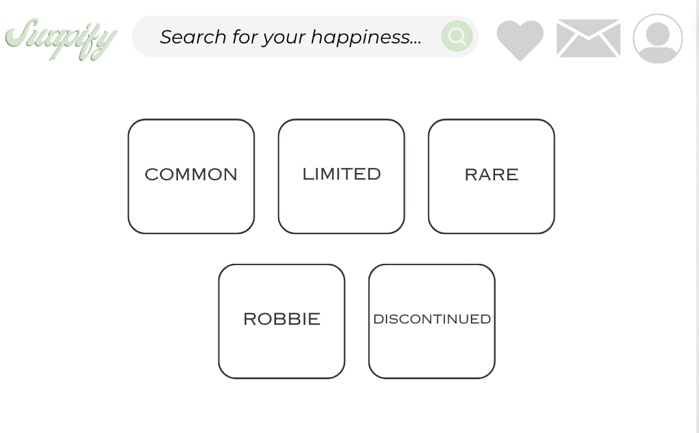
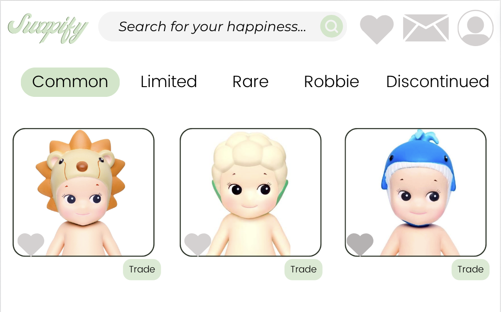
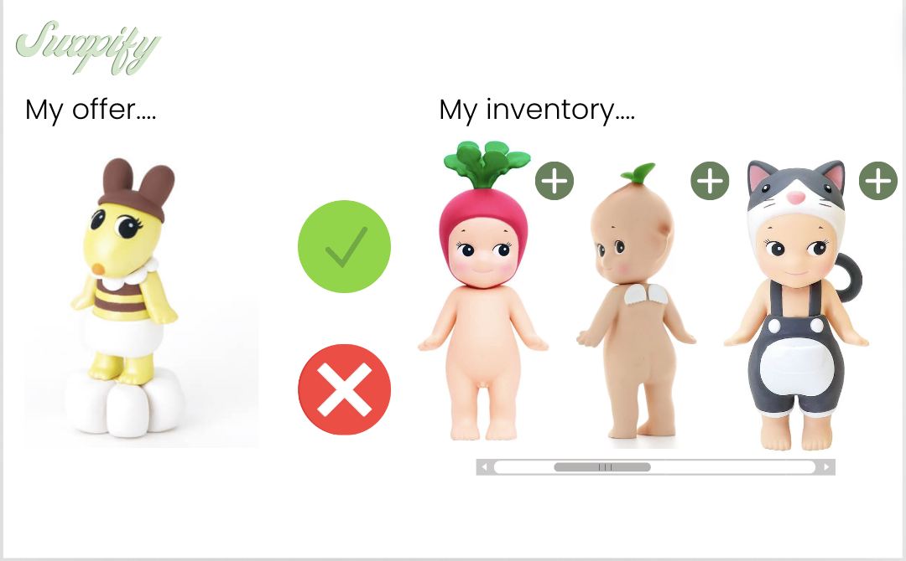
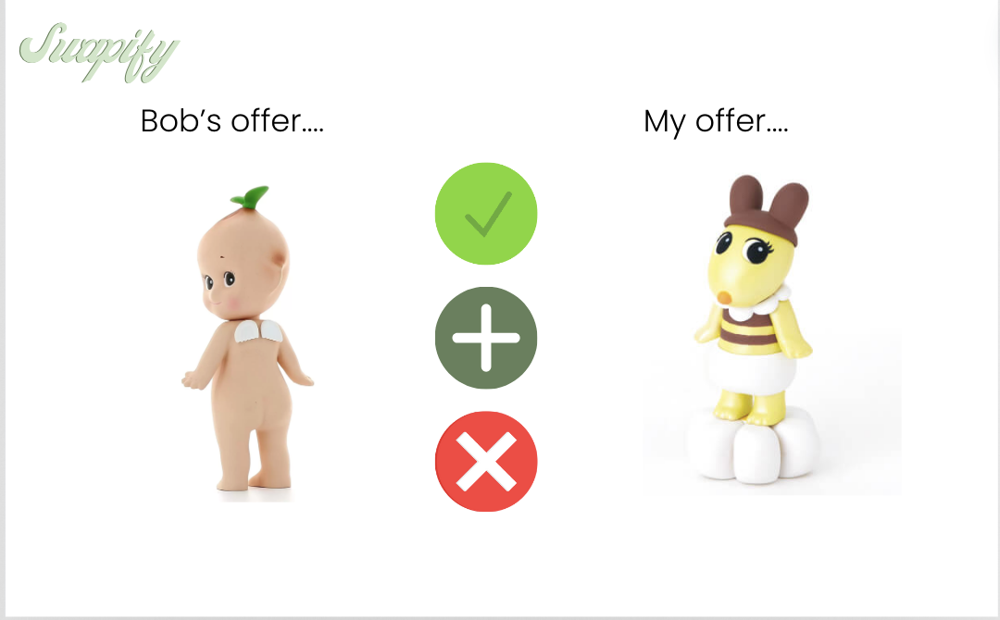
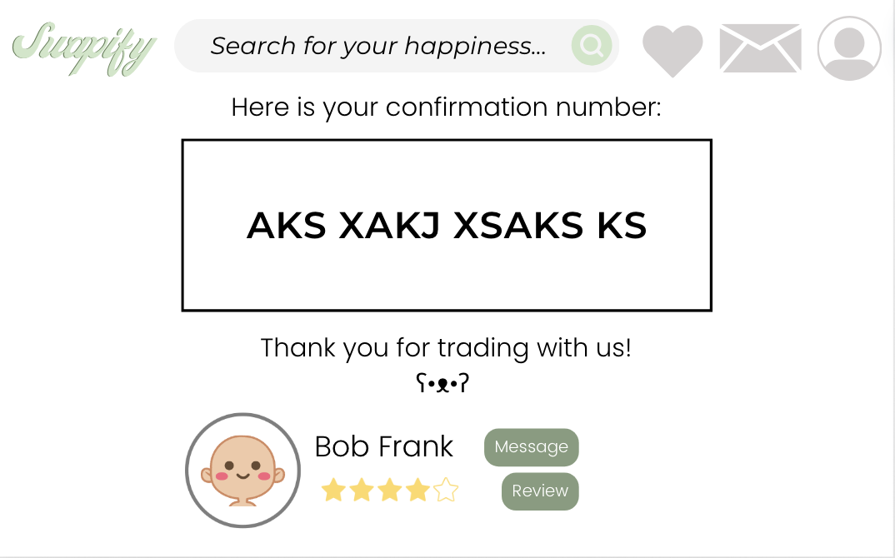
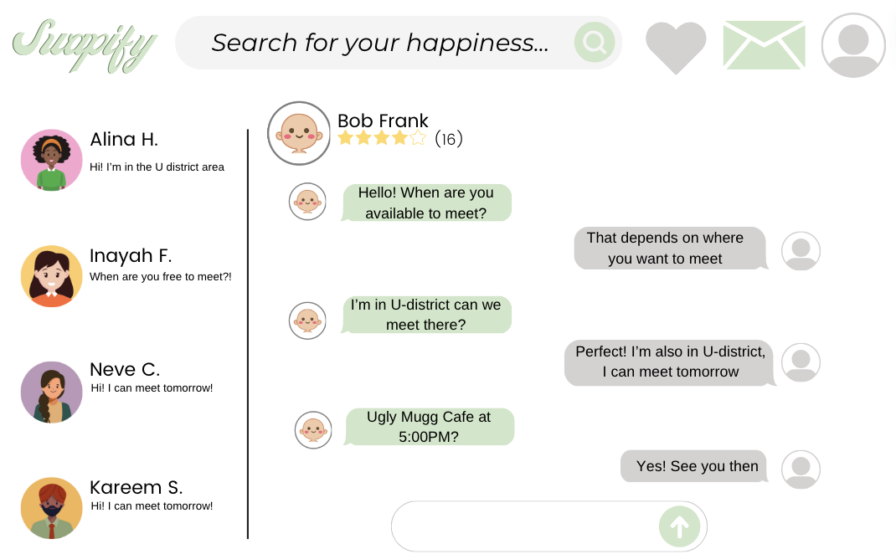
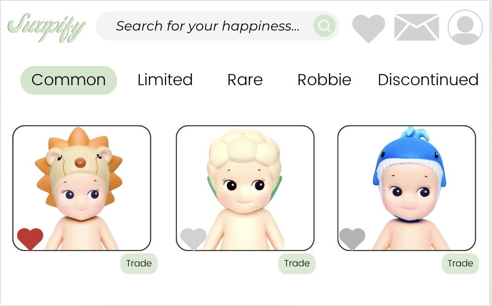
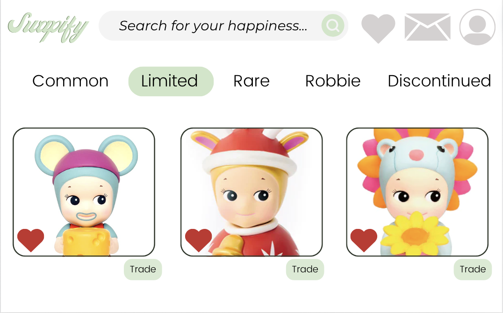

# Components
## Home
On the home page, we allow the user to click on categories (mentioned below) that Sonny Angels fall into so individuals can browse their intended interests. The classification of Sonny Angels falls into the following categories: common (very easy to pull), limited (angels that are sold for only a specific time frame), rare (sonnies that have a smaller chance to pull), Robby (which is a secret Sonny, taking the form of an ambiguous animal, with the lowest possibility to pull) and discontinued (meaning they are no longer being sold). We also added a search bar for scenarios in which the user knows exactly the name of the Sonny that they are looking for.  The home page also includes a favorites page, which is a page that contains all the Sonnies that the user has heart-ed when browsing. The message icon contains the user’s messages with other traders. The person icon is the user’s profile that they can navigate to.
## Trading
On the trading screen between two users, the screen shows the trade proposals between two users, and there are three choices that can be executed. The green check mark means that you accept the trade, the plus icon means that you want the other user to add more, and the red ‘x’ mark means you decline the trade. If the user asks for more Sonnies to be added to the trade, the user can go into their inventory of Sonnies and add more using the plus button, or they can decline the request to add more. After their actions, they can press the green checkmark or the red ‘x’ button. If the trade is accepted by both users meaning they both press the green checkmark then they will receive a confirmation page to message the user to plan the trade
## Messages
A user can find the user they want to chat with through their listings on their homepage to go to their profile and click the “Message” button. There will be a confirmed trade option. The user can click the envelope icon leading to the messages/inbox page and search or click on their conversation.
## Profile
Our profile page includes very standard information such as first and last name, reviews on a five-star rating scale, length of membership, and current ISOs (in search of). Additionally, there are three main tab components that we’ve included. The first consists of a ‘Public’ tab containing information visible to anyone viewing another individual’s profile, including current tradeable Sonny Angels, past transactions, and a general mapped area of where this individual resides. The second consists of a ‘Reviews’ tab containing reviews left by past interactions on the platform. Not to mention, there is a button where only an individual who successfully has made a trade with this individual can click the button to leave a review on the person’s public profile. Lastly, we have the settings tab of the profile page, where only the owner of the profile can view it. This will include personal information (first and last name, birth date, phone number, email information, and password)
## Favorites
On our favorites page, users can check which items are liked by the user themselves on another page (while searching for an item, for example). A list would be displayed to showcase the different items being liked. However, users can still select which section they prefer (with the three subheadings) and a search bar. Users can go through the favorites page as a ‘shortcut’ to finding the right item(s) to trade with.
## Wizardry
For the sake of this assignment, our wizardry will consist of bringing in our own Sonny Angels to simulate a “fake online trade.” Since it’s difficult to simulate specific scenarios in our mock-up, such as adding items and declining requests, we will physically be doing this in our peer review. Additionally, we will fake “favoriting” a specific Sonny Angel while browsing through a specific category.

## Prototype Visuals:
Home: 
Clicking common: 
Clicking trade: 
Submitting trade for review by Bob: 
Confirming trade: 
Clicking message to plan trade: 
Favoriting Page: 
Clicking heart: 
Viewing favorite page: 
