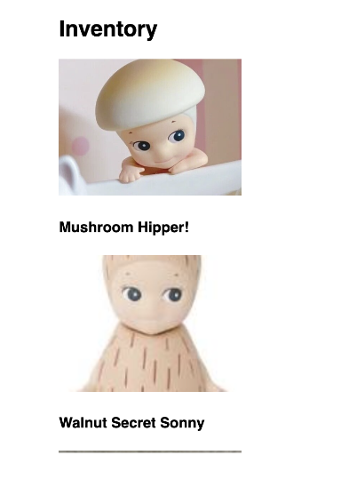
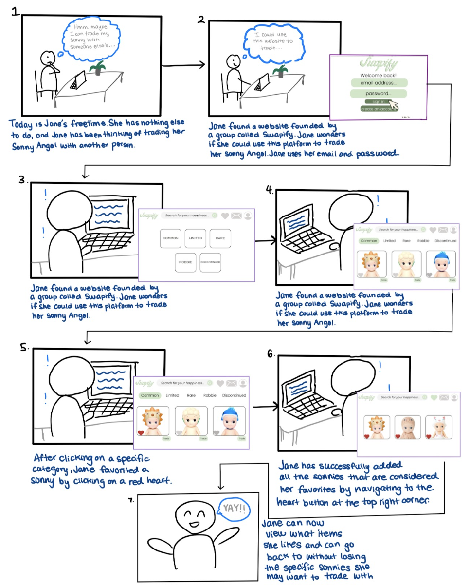

# Code and Design Specification
## Functional Requirements:
The primary functional requirements we would like to implement would be to allow users to create an account on our platform and be able to log in. From there, individuals can customize their profile to store their Sonny Angel inventory. Not to mention, individuals can add, delete, or edit their inventory. All Sonny Angels will be categorized into different pages depending on their status (common, limited, secret, Robby, discontinued), so individuals can click on a category and search for Sonny Angels in that specific category. Currently, we plan to host a place for traders to view other traders’ inventories and search for their desired items, otherwise known as ISOs (in search of). Additionally, will allow for the actual trading and bartering via piggyback prototyping using other messaging sites such as Instagram, Messenger, or Discord. As for secondary functional requirements, we hope to incorporate reviews within the profile and a personal favorites page that individuals can reference when browsing.

## Technical Requirements:
Swapify will be an online website hosted by WIX.com where our primary components will utilize APIs provided on their marketplace webpage to log in, create an account, and submit their Sonny Angel inventory information. The webpage will be intended for website use on a computer but can be accessed via tablet or phone. However, the website view is our current priority.

## Usability Requirements:
For our website, it would be easy for a first-time user to navigate through if they have purchased from any online platform. Our website will have similar features to platforms like Mercari, Depop, FaceBook, and Amazon. The components of our website will be user-friendly, and we don’t intend to incorporate any difficult features. Users will be able to navigate through our website smoothly with our approach of categorizing Sonny Angels, a favorites page, and a personal inventory portion in their profile. Lastly, we will ensure that the buttons are intuitive and consistent with other platforms, so our features will not take the user by surprise.

## Architectural Design:

Our architectural design will consist of five pages. First, we will have our ‘Home’ page, which will contain five categories: common/regular, limited, secret, Robby, and discontinued. Based on the category the individual clicks, they will be redirected to another page that only displays that category's Sonny Angels. We will also have some sort of structure called SonnyAngels, which will contain ~6 fields: image, name, series, mrkt_value, favorite, and category. We will use these fields for varying things. For example, the category field will allow us to sort and display the Sonny Angels into the corresponding category page, and the favorites field will allow us to correctly place favorited items into the ‘Favorites’ page. As for our ‘Profile’ page, it will contain a subpage for an individual's inventory. This area will contain a button that allows users to add new items and add/delete/edit existing items.

## System Description:
The description in our architectural design will enable the requirements described in our requirements and storyboards through several aspects. These aspects include a home page where individuals can freely browse through Sonny Angel listings. We will have a profile page that serves primarily as an inventory of tradeable Sonnys that the owner has available. Additionally, individuals browsing another individual’s profile will easily be able to view if they have multiple of their ISOs (in search of). Overall, the main structure we will be utilizing is a SonnyAngels structure, which we will use for just about all of our pages as a means of displaying items and information.

## Storyboard(s):
The following storyboard follows an individual uploading new items into their inventory (profile):

The following storyboard follows an individual clicking a certain category, favoriting an item, and navigating to the ‘Favorites’:

The following storyboard follows an individual creating an account:
