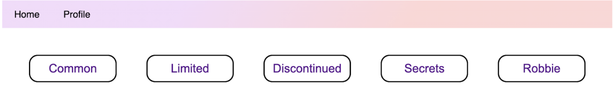
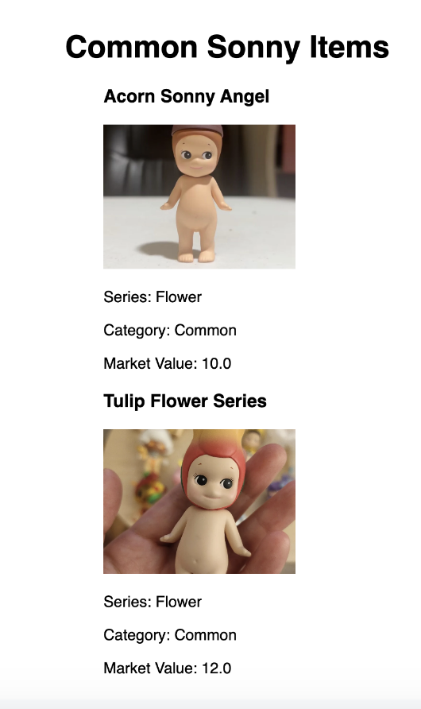
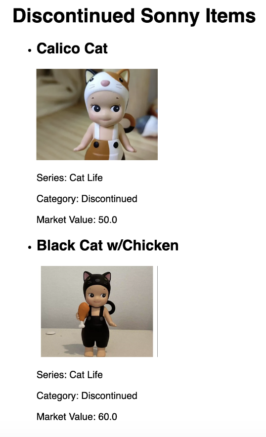
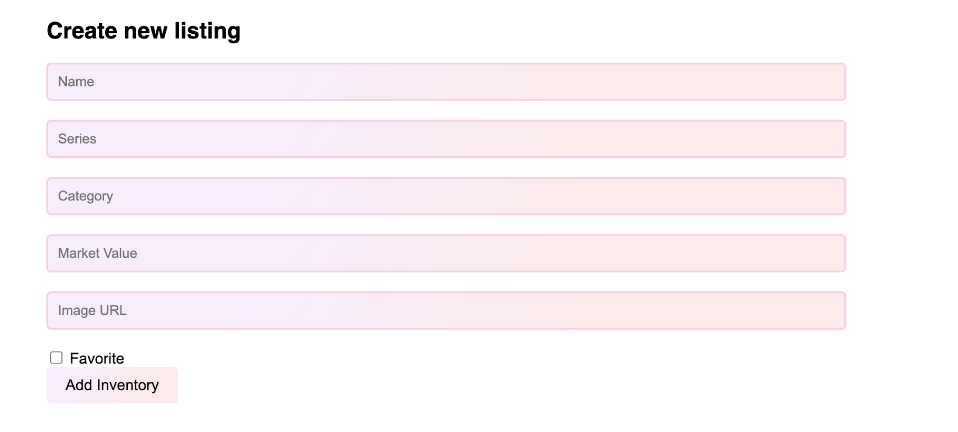
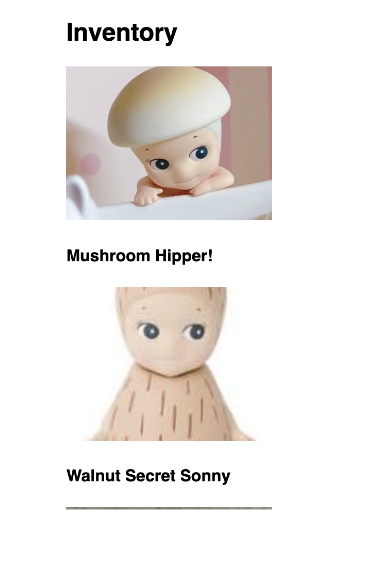

# User Testing
## Description of your medium-fidelity prototype
**Q: What are the two functionalities you implemented (coded)? Where in your GitHub repository can we find the code for it and what Github issues address those functionalities?**\
A: We utilized the flask framework with HTML, CSS for the structure of Swapify. Including a profile page, login/signup page, categories for sonny angel listings and functionality to add sonny angel trading listings to the website. The code for the HTML structure is undertemplates and the CSS under the static folder.\
One of the functionalities we implemented was having a login and sign-up page. Our code can be found in the templates and DB folders. Since we switched gears from having synchronous trading to allowing users to create their desired Sonnies and their inventory, having an account was necessary for our prototype. Not to mention, each user will have their favorites page, which tracks what Sonny Angels a user wants. We also have an inventory page, which keeps track of the Sonny Angels that a user owns so that other people can see it.\
We used the Flask framework to connect the login and create account pages so individuals can create an account and log in to their account the next time they access the webpage. Additionally, we utilized the assistance of the Python language to implement the whole system. This framework provides interaction within the entire webpage system, including creating account and login pages. SQL is also used to connect the pages with a database. This database would store all the necessary information for users to log in to their accounts once they create their account with their information. All the interactions can be found in the app.py file and test.db in the instances folder, where the storage of account information within a table would be stored.\
Lastly, we connected the database, which holds all the metadata of Sonny Angels added to inventories. In the backend, we successfully stored individual items and connected them to the user interface so that individuals could browse through the varying items (i.e., Sonny Angels). These changes are visually reflected in two locations. The first location is the profile page, where an individual will add a Sonny to their inventory, and it will appear on the profile. The second location is on the varying categories pages, where, depending on the given Sonny category, it will display in its corresponding category HTML webpage. The HTML files are located in the templates folder, and the code that handles the connection between the frontend and backend are in the root directory in a file called app.py. Lastly, there is also a test_nancy.DB (temporary naming) file in the root directory that contains the SQL table we use to store the Sonny Angels.

**Q: How did you prototype the other functionalities? (Did you omit them, or wizard-of-oz them?)**\
A: We're omitting the rest of our functionalities as we haven’t had the chance to get to them yet. However, we do plan on tackling these tasks in the upcoming week. Lastly, we did want to mention that a certain part currently utilizes the wizard-of-oz approach. Currently, we’re creating all Sonny listings under one “account.” In other words, under one profile, we’re adding Sonny listings so that they’ll show up under the categories, but eventually, items from varying profiles/users should be populating our platform.

## Screenshot/Photo of the Prototype
**Home Page**
\
**Reviewing Listings**
<table>
  <tr>
    <td></td>
    <td></td>
  </tr>
</table>

**Adding Sonny Items**
\
**Invetory**\

## Findings from User Testing Sessions
**Q: What did you learn in the user testing sessions?**\
A: We learned several things from our user testing sessions, which were helpful and insightful. First, there was a common theme in requesting a separate button to add listings. Currently, individuals can only add listings by navigating to their ‘Profile.’ Ideally, we will add a button that will prompt some sort of “pop-up” on the current screen an individual is on, and then they can add a new listing. Next, we realized it was inconvenient for users to click on a category, navigate back to the home screen, click on a different category, and so on. Thus, we will be implementing some sort of filtering on our ‘Home’ page with all the listings, so instead, we will use the buttons as filters on the page. We will also add an ‘About’ section to describe the categories to new and incoming users, since it can be foreign information to new enthusiasts. Lastly, we found that we should add required fields in the create account and log-in pages, organize the lists of Sonnies as a grid to make it easier for viewers to see, and support uploading images rather than obtaining URLs.

**Q: Are the findings promising enough that you would like to go ahead with the current functionality of the prototype? (If yes, describe why, if no, describe what changes you are proposing to make.)**\
A: Based on the findings from user testing, there are parts that we think we should keep. Everyone seemed to be enjoying our feature of adding listings to their profile. However, we also found that not many people seemed to be interested in the ‘Favorites’ page, so we’re leaving that as a last priority for our implementation.

**Q: What are the next functionalities that you will implement in your prototype?**\
A: We plan to create more functionalities as our prototype progresses. We plan to add a favorites page, where users will have the opportunity to favorite different sonnies. A part of a functionality we have yet to implement, but we may add to it, is to implement cookies to let users store all the information that they have inputted into their ‘Inventory’ and their favorites pages.\
During our usability testing session, the feedback we received consisted of adding a more convenient button/popup for the user to add a new listing rather than having it on only one page. Additionally, we noticed that we needed to create a more user-friendly navigation system for the Sonny Angels categories. Currently, the user has to go back to the home page to select a new category each time. An idea to fix this inconvenience is to have some type of dropdown menu for selecting a category. A helpful tool for new users is to add an “About” icon that describes each category. Other supplementary feedback received was to have required fields for the signup and log-in page. Additionally, some visual feedback we got was to have a grid layout that is easier for users to see and be able to upload images rather than getting URLS.\
As of right now, our current functionality of the prototype is minimal but usable. However, we intend to implement more features to make it more user-friendly and optimal. The functionality we will add to our prototype consists of adding a favorites page, allowing users to favorite Sonny Angels that they want. We would like to implement cookies so that users can store the information that they have inputted into their inventory and favorites page since, as of right now, the users’ information is forgotten once the localhost page closes.

